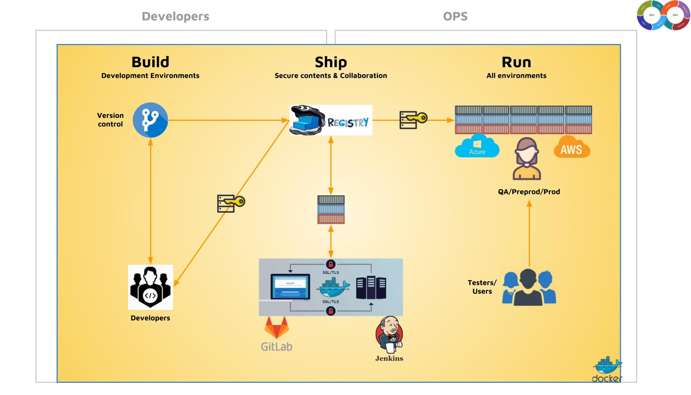

# CICD workflow

How to do continuous job: workflow steps
[][1]

[1]: ../images/cicd-workflow.jpg

## Overview
The following workflow provides an example and a starting point for development teams to reference.  Teams should refine the following process so that it meets their specific needs and goals.

## Environments
For this workflow, the process assumes there are 3 environments for testing.  The environment descriptions are included below.

* Local - Development environment utilized while creating or fixing a feature.
* Build - Environment where PR builder is run and where the build artifact is created (Build Server).
* Staging - Test environment intended for smoke testing.
* PreProd - Environment which enables testing against production dependencies. In this process, it's designed for regression testing.
* Production - Live environment where all users can leverage the product.

## Branching Strategy
A clear and well understood branching strategy is a critical component of a CICD process. One valid strategy is **feature branches** based on [Github Flow](https://guides.github.com/introduction/flow/index.html).  Feature branches assume that master or your production branch is always production ready.  Branches are based on functional features or bug fixes.

* **Goal:**
    * Clearly communicate the state of a feature or fix as it pertains to managing code
    * Provide easy to use strategy for merging features and fixes

## Dev Done
As in any development workflow, the later an issue is found in the process the more expensive and time consuming it is to fix.  Before moving a code change out of development, sufficient validation and quality assurance should be performed. The 'Dev Done' step is the first step in the CICD process.  

* **Goals:**
    * Prevent syntax errors
    * Prevent easily found defects from entering the process
    * Achieve team buy-in / validation of implementation
    * Validate code is mergeable with latest release

* **Manual Process:**
    * Peer Review(s) once PR builder is successful
    * UX/UI review by design/dev hybrid (either by checking out work locally for interactive features, or via screen shots posted to the Pull-Request)
    * Fixes and enhancements completed per feedback in Pull-Request
    * Start CICD process once Pull-Request is approved by team for testing

* **Automated Process:**
    * Pull-Request builder
        * Lint code base
        * 90% Unit test coverage
        * Mocked functional regression test
        * Pull-Request is Mergable

## Build
The CICD process should only perform the build once and create a single artifact. The build artifact is utilized in each environment for testing and its eventual release.

* **Goals:**
    * Create a build which can be deployed to each environment
    * Secondary - Generate API documentation

* **Manual Process:**
    * Create new build with:
        * Branch name in Pull-Request
        * Data for change request (ie: details, time, severity, etc.)

* **Automated Process:**
    * Initial Actions:
        * Build App
        * Create RPM
        * Add RPM to repository
    * Post Actions:
        * Alert team if build is unsuccessful
        * Automatically start 'Deploy to Staging'

## Deploy Staging
Once a build has been created, the build should be deployed to a reliable test environment.  The intent is to validate that the build artifact can be deployed reliable to an environment.

* **Goals:**
    * Validate builds can be deployed successfully
    * Deploy the build so it can be validated in a test environment

* **Automated Process:**
    * Initial Actions:
        * Download RPM from repository created in Build step
        * Install RPM
        * Restart service to run code
    * Post Actions:
        * Alert team if deployment is unsuccessful
        * Automatically start 'Perform Smoke' step if build is successful

## Perform Smoke
Now that the build has been deployed, the next step is to validate critical functionality.  Smoke tests are performed in the test environment.  The test suite should be kept small so that tests can be executed quickly.

* **Goals:**
    * Validate the deployment is functional
    * Validate critical functionality
    * Alert team if any errors are
    * Report the results of test suite

* **Automated Process:**
    * Initial Actions:
        * Build server runs smoke test suite
    * Post Actions:
        * Generate results report
        * Alert team of failure (ie: email, irc channel, etc.)
        * Automatically start 'PreProd Deployment' if smoke test completes successfully

## Deploy PreProd
Once smoke testing has validated critical functionality, the next step is to move the code to a pre-production environment. The PreProd environment allows for testing functionality against live production systems without exposing it to end users.  Since PreProd leverages, production endpoints, testing should be isolated to test accounts only.

* **Goals:**
    * Validate all existing and new functionality via Regression testing
    * Determine whether the build meets quality standard for release into production

* **Automated Process:**
    * Initial Actions:
        * Download RPM from repository created in Build step
        * Install RPM
        * Restart service to run
    * Post Actions:
        * Alert team if deployment fails
        * Automatically start 'Perform Regression' step

## Perform Regression
The regression test step validates all existing and new functionality introduced via the Pull-Request.  This step requires the most time and rigor to execute.

* **Goals:**
    * Validate all new and existing functionality
    * Ensure no unintended behavior is introduced
    * Determine whether or not build is ready for production

* **Automated Process:**
    * Initial Actions:
        * Build server runs regression test suite
    * Post Actions:
        * Alert team if regression test suite fails
        * Success:
            * Promote build in RPM to stable / production ready
            * Merge pull-request into master
            * Tag last commit in master with semantic versioning
            * Create change request via API

## Deploy Production
At this point, the build has been sufficienlty validated and is ready for deployment in production.  This step assumes the team follows a change request process and requires manual intervention to kickoff.  

* **Goals:**
    * Release feature or fix to production

* **Manual Process:**
    * Start deployment via the build server

* **Automated Process:**
    * Initial Actions:
        * Download RPM from repository
        * Install RPM
        * Restart Service to run
    * Post Actions:
        * Run test scripts in production environment
        * Success:
            * Alert team
        * Failure:
            * Alert team
            * Redeploy last valid build
