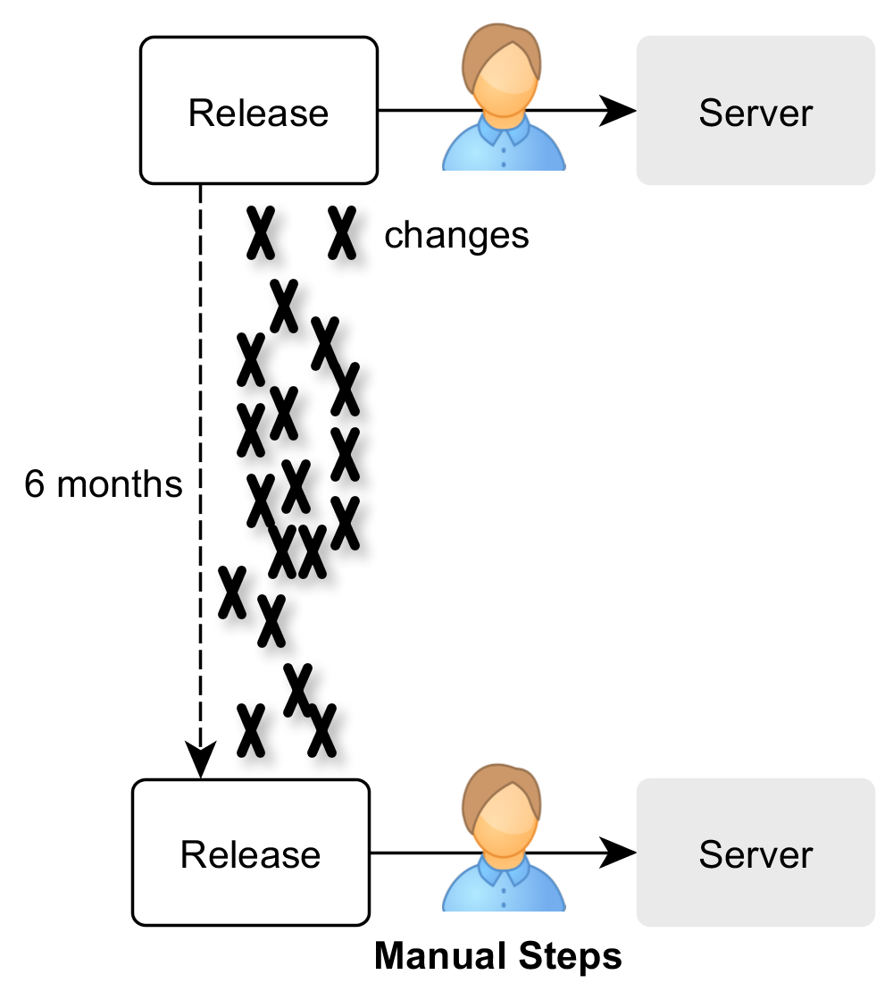
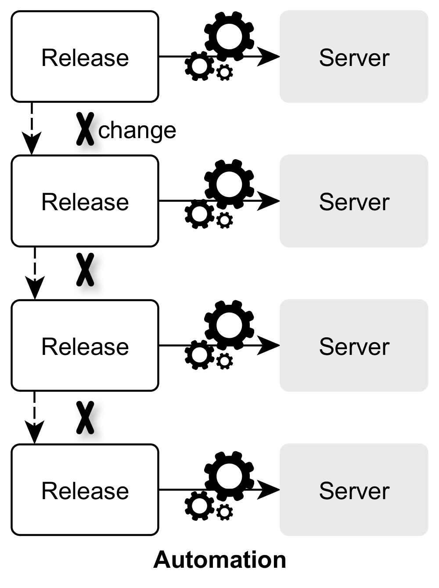
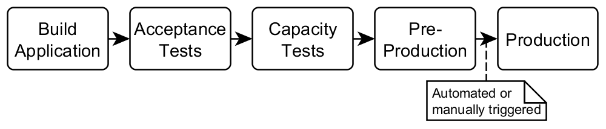

# Continuous Delivery with Docker and Jenkins

## Traditional Release Cycle
Following the “old-school” release approach means to ship a release after a certain amount of time (let’s say 6 months). 
We have to package the release, test it, set up or update the necessary infrastructure and finally deploy it on the server.
[][1]

[1]: ../images/traditional-release-cycle.png

What are the problems about this approach?

* The release process is done rarely. Consequently, we are barely practiced in releasing. Mistakes can happen more easily.
* Manual steps. The release process consists of a lot of steps which have to be performed manually (shutdown, set up/update infrastructure, deployment, restart and manual tests). The consequences:
  * Mistakes are more likely to happen when executing these steps manually.
  * The whole release process is more laborious, cumbersome and takes more time.
* There have been a lot of changes performed since the last release 6 months ago. It’s likely that
  * something will go wrong when trying to put the different components together (e.g. version conflicts, side-effects, incompatible components) or
  * that there are bugs in the application itself.
  * But it is hard to see what change is causing the problem, because there have been a lot of changes. The point is that those problems are discovered too late. We are getting feedback too late, because we are trying to release the application too late in the development process and not regularly. We are only trying to release, when we really want to create a release.

## Continuous Delivery

<aside class="notice">
“If it hurts do it more often and bring the pain forward.”
A Practical Guide to Continuous Delivery by Eberhard Wolff
</aside>

We reduce the pain of releasing by releasing more often. Therefore, we have to automate the whole release process (including package release, set up/update infrastructure, deploy, final tests) and eliminate all manual steps. This way we can increase the release frequency.

[][2]

[2]: ../images/continuous-delivery.png

What are the benefits of this approach?

* Fewer mistakes can happen during an automated process in comparison to a manual one.
* There are fewer changes done between two releases. The danger of mistakes is quite small and we can easily track them back to the causing change.
* We don’t package and ship our application at the end of a development phase. We are doing it early and frequently. This way we’ll discover problems in the release process very soon.
* Due to the automated release process we can bring business value faster into production and therefore reduce the time-to-market.
* Deploying our application into production is low-risk, because we just execute the same automated process for the production as we did for the tests or the pre-production system.

All in all, Continuous Delivery is about

* **reduced risks**,
* **increased reliability**,
* faster feedback,
* accelerated release speed and time-to-market.

## Continuous Delivery using Docker

From the technical point of view Continuous Delivery revolves around the automation and optimization of the delivery pipeline. A simple delivery pipeline could look like this:

[][3]

[3]: ../images/delivery-pipeline.png

The big challenge is the automated setup of the infrastructure and environment, our application needs to run. 
And we need this infrastructure for _every stage_ of our delivery pipeline. Fortunately, Docker is great at creating reproducible infrastructures. 
Using Docker we create an image that contains our application and the necessary infrastructure (for instance the application server, JRE, VM arguments, files, permissions). 
The only thing we have to do is to execute the image in every stage of the delivery pipeline and our application will be up and running. Moreover, Docker is a (lightweight) virtualization, 
so we can easily clean up old versions of the application and its infrastructure just by stopping the Docker container.

