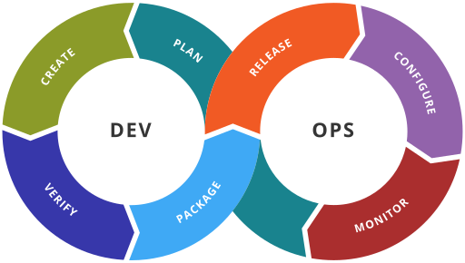

# What is CI/CD

[][1]

A CICD pipeline is the combination of [Continuous Integration (CI) and Continuous Deployment or Continuous Delivery (CD)](https://opensource.com/article/18/8/what-cicd), 
with automation such that a commit to a source code repository triggers the build, test and packaging of an application that’s then deployed to a cluster.

[1]: images/devops.png

